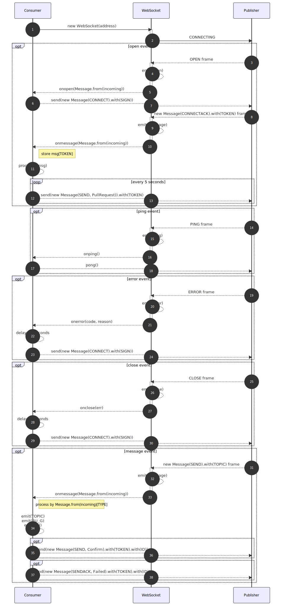

# tmc.js

Event driven and chained Taobao Message Channel(TMC) for NodeJS

[](https://github.com/TheNorthMemory/tmc.js/releases)
[](https://snyk.io/advisor/npm-package/tmc.js)
[](https://www.npmjs.com/package/tmc.js)
[](https://www.npmjs.com/package/tmc.js)
[](https://www.npmjs.com/package/tmc.js)
[](https://www.npmjs.com/package/tmc.js)

## 设计

核心包以事件作为驱动，通过注册`TOPIC`回调处理函数，实现了TMC产品服务的消息消费处理能力，同时通过`Proxy`代理，以`TOPIC`作为键值，平序注册消息消费处理函数，序图如下：

[](./.github/sdk-sequence.mmd)

## 使用

`npm i tmc.js`

```js
import Tmc from 'tmc.js';

new Tmc('your_app_key', 'your_app_secret')
.on('taobao_trade_TradeChanged', msg => console.info(msg))
.taobao_trade_TradeClose(msg => console.info(msg))
.connect();
```

## API

**`new Tmc(appKey: string, appSecret: BinaryLike, groupName?: string | ConsumerOptions, options?: ConsumerOptions)`**

| 参数 | 类型 | 说明 |
| --- | --- | --- |
| appKey | `string` | 应用ID |
| appSecret | `BinaryLike` | 应用密钥 |
| groupName | `string \| ConsumerOptions` | 消息分组(可选，默认`default`) |
| options | `ConsumerOptions` | 消费端配置参数(可选) |
| options.pullRequestInterval | `number` | 定时发送`pullRequest`请求时间间隔(默认`5000`毫秒) |
| options.onErrorReconnection | `number` | 当消费端出现错误，重试连接间隔(默认`15000`毫秒) |
| options.onCloseReconnection | `number` | 当消费端断开连接，重试连接间隔(默认`3000`毫秒) |
| options.autoParseContentJson | `boolean` | 自动解析推送消息`$.content.content`字段为对象(默认`true`) |
| options.autoReplyConfirmation | `boolean` | 以推送的`$.content.id`字段自动`Confirm`消息(默认`true`) |
| options.autoGroupedEmitting | `boolean` | 以`/^(([^_]+)_[^_]+)_.+/`规则切分`$.content.topic`主题，开关消费端多维监听功能(默认`true`) |

**`tmc.on(topic: string, listener: (this: Tmc, message: Message) => void) => Tmc`**

注册 `topic` 消息通知处理函数，默认已内置 [消息](./types/message.in.d.ts) 说明。
自`v0.3.6`起，默认开启消费端多维监听功能，`topic`字符串也可以是`BU`及`BU_G`单位，例如：

```js
.on('taobao', console.info)
.on('alibaba_einvoice', console.info)
```

**`tmc[<topic>](fn: (this: Tmc, message: Message) => void) => Tmc`**

直接以 `topic` 为键值，注册消息通知处理函数。
自`v0.3.6`起，默认开启消费端多维监听功能，`topic`字符串也可以是`BU`及`BU_G`单位，例如：

```js
.taobao(console.info)
.alibaba_einvoice(console.info)
```

**`tmc.reconnect(ms: number) => Tmc`**

当消费端 `onerror`/`onclose` 事件发生时，延迟 `ms` 毫秒自动重新建立连接。

**`tmc.connect(address?: string) => Tmc`**

消费端发起建立连接 `onopen` 事件，`address` 默认为 `ws://mc.api.taobao.com/`。

**`tmc.send(msg: Message, options?: { mask?: true, binary?: true }, cb?: (err: Error) => void) => void`**

自`v0.3.4`起，当自动应答确认消息无法满足需求的时候，比如消息处理失败，需要`Publisher`再次重推消息，在实例初始化时置`options.autoReplyConfirmation=false`，则在消息处理函数内，可以通过 `this.send()` 函数回复`确认`或者`失败`消息。例如：

```js
new Tmc('your_app_key', 'your_app_secret', { autoReplyConfirmation: false })
.taobao_trade_TradeDelayConfirmPay(function needDoubleRetriesThenConfirm(msg) {
  if (msg instanceof Message && msg.content?.retried === 0) {
    this.send(
      new Message(MessageType.SENDACK, MessageKind.Failed)
      .with(MessageFields.ID, msg.content?.id)
      .with(MessageFields.MSG, 'Something went wrong, please retries this ID.')
    );
  }
})
.connect();
```

也可以使用此方法发送`To淘宝`消息。在`>=v0.3.4 && <v0.3.7`版本期间，需要自主对`$.content.content`数据做`JSON`字符串化(**特别注意：** 原生`JSON`对`BigInt`类型无法处理)。自`v0.3.7`起，可直接对`$.content.content`以原生`object`类型描述，`SDK`会将此对象转化成`JSON`字符串。例如：

```js
/** @see https://open.taobao.com/tmc.htm?docId=732&docType=9 */
.send(
  new Message(MessageType.SEND, MessageKind.Data)
  .with(MessageFields.TOPIC, 'taobao_fuwu_ElectronicInvoice')
  .with(MessageFields.CONTENT, {
    id: 12345678901234567n, // 支持 BigInt 类型
    tid: 12345678901234567n,
    oid: 12345678901234567n,
    invoice_file: 12345678901234567n,
    e_invoice_no: '12342243435466',
    invoice_time: '2015-04-10 10:33:49', // 时区 +08:00
    invoice_no: '123456',
    invoice_code: '123456',
    amount: '100.00',
  })
  // >=v0.3.4 && <v0.3.7 写法
  // .with(MessageFields.CONTENT, '{"tid":12345678901234567,"amount":"100.00"}')
)
```

<details><summary>可选设置的 NODE_DEBUG=< label > 环境变量</summary>

| label | 说明 |
| --- | --- |
| `tmc:onping` | 开启 `onping` 时的日志
| `tmc:onopen` | 开启 `onopen` 时的日志
| `tmc:onpull` | 开启 `onpull` 时的日志
| `tmc:onerror` | 开启 `onerror` 时的日志
| `tmc:onclose` | 开启 `onclose` 时的日志
| `tmc:onmessage*` | 开启全部 `onmessage` 时的日志(即`From`淘宝消息)
| `tmc:onmessage:connect` | 开启消费端发起连接 `connect` 时的日志
| `tmc:onmessage:connectack` | 开启消费端回复连接 `connectack` 时的日志
| `tmc:onmessage:send` | 开启消费端接收到(即`From`淘宝) `send` 的消息时的日志
| `tmc:onmessage:sendack` | 当消费端收到(`From`淘宝)消息，消费端消息处理失败，需要服务端重发，须回复`SENDACK(3)`及`FLAG`字典值时的日志
| `tmc:onmessage:send:confirm` | 开启消费端回复接收到的(即`From`淘宝消息)，发送自动确认 `send:confirm` 时的日志

</details>

## 支持的TOPICS

<details><summary>共计 85+ 类别，509+ 消息数</summary>

| 类别 | 消息数 |
| --- | --- |
| 淘宝交易 | 25 |
| 淘宝退款 | 13 |
| 淘宝商品 | 13 |
| 淘宝分销 | 27 |
| 淘宝点点 | 12 |
| 淘宝火车票 | 6 |
| 平台消息 | 9 |
| 交易全链路 | 3 |
| 淘宝机票 | 15 |
| 导购平台 | 21 |
| 淘宝汽车票 | 4 |
| 服务市场 | 9 |
| 天猫服务 | 30 |
| 天猫美妆 | 2 |
| 聚石塔 | 9 |
| 淘宝物流 | 1 |
| 阿里通信 | 20 |
| 天猫魔盒 | 2 |
| 营销平台 | 1 |
| OpenIM消息 | 1 |
| 网上法庭 | 8 |
| 电子发票 | 21 |
| 航旅度假交易 | 8 |
| YunOS YoC | 2 |
| 淘宝直播API | 3 |
| 阿里物联 | 2 |
| 全球购跨境物流 | 1 |
| 零售plus | 8 |
| 客户运营平台API | 19 |
| AE-交易 | 10 |
| 五道口配送 | 5 |
| 百川 | 2 |
| 闲鱼 | 23 |
| 闲鱼回收商消息 | 6 |
| 零售通POS开放平台消息 | 4 |
| DPAAS | 6 |
| AliGenius | 1 |
| 智慧门店下行消息 | 2 |
| 渠道中心API | 4 |
| 五道口订单 | 22 |
| 信息平台-采购 | 3 |
| 1688服务市场 | 1 |
| 酒店商品消息api | 9 |
| 新零售终端下行消息 | 1 |
| 新零售终端上行消息 | 4 |
| 欢行开放平台 | 1 |
| 阿里发票 | 5 |
| 大麦票单状态 | 1 |
| 五道口营销 | 4 |
| 酒店签约中心消息 | 3 |
| 蜂鸟物流 | 6 |
| 商旅API | 3 |
| 阿里健康-O2O中台 | 2 |
| 业务平台新零售-消息上行 | 2 |
| 大麦第三方票务供应商接入 | 9 |
| TVOS应用审核平台 | 1 |
| Gifting送礼 | 1 |
| 五道口商品 | 2 |
| HOMEAI | 2 |
| HOMEAI消息对接 | 5 |
| 零售通_公共 | 8 |
| 酒店标准库基础信息变更消息 | 3 |
| 菜鸟发货工作台 | 1 |
| IOT-智能制造 | 2 |
| 智能制造API | 1 |
| ICBU-交易 | 1 |
| IoT售后解决方案 | 1 |
| OpenMall-API | 5 |
| 闲鱼已验货 | 6 |
| 阿里健康三方机构 | 2 |
| 聚石塔监控告警 | 2 |
| 大资产拍卖Top端拍品消息 | 2 |
| AE-任务平台消息 | 1 |
| 天猫汽车 | 5 |
| 阿信消息通知前台类目 | 4 |
| 阿里健康追溯码 | 1 |
| 自动驾驶API | 3 |
| MMC五盘货项目 | 5 |
| 银泰开放平台消息 | 2 |
| 阿里智付 | 1 |
| 代发管理 | 2 |
| 蚂蚁采购 | 1 |
| 阿里健康&一树-电商中台对接 | 2 |
| 阿里健康-疫苗 | 2 |
| 智能应用 | 1 |

</details>

## 链接

- [淘宝开放平台-消息服务使用介绍](https://open.taobao.com/doc.htm?docId=101663&docType=1)

## 变更历史

It used [the github release page for the Changelog](https://github.com/TheNorthMemory/tmc.js/releases) here.

## License

[MIT](LICENSE)
